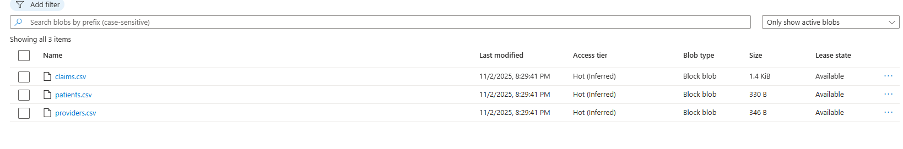
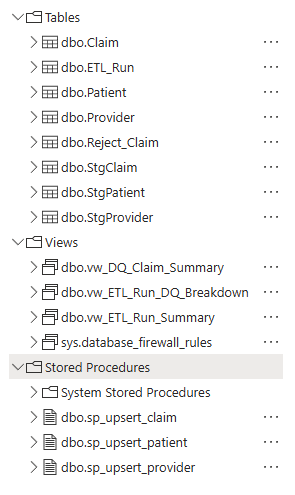
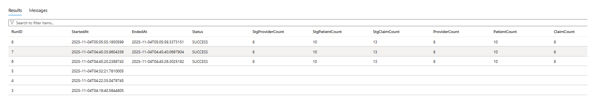

# 🩺 Azure Healthcare Data Engineering Pipeline

[](https://azure.microsoft.com)
[](https://www.python.org)
[](https://learn.microsoft.com/sql)
[](https://powerbi.microsoft.com)

> **Author:** [Kevin Braman](https://www.linkedin.com/in/kevin-braman-a7974a129/)  
> **GitHub:** [kevinbraman92](https://github.com/kevinbraman92)  
> **Tech Stack:** Python · Azure SQL · Azure Blob Storage · Azure Data Factory · Power BI

---

## 🌐 Overview

This project demonstrates a **production-grade data engineering pipeline** built on **Microsoft Azure**.  
It ingests healthcare-style CSV data (providers, patients, claims) from **Azure Blob Storage**, stages it in **Azure SQL Database**, performs **idempotent upserts** using `MERGE`, and enforces **data-quality and audit tracking**.

It’s designed to mirror what a professional Data Engineer would build in an enterprise healthcare environment—clean, modular, automated, and fully observable.

---

## ☁️ Azure Blob Storage

<p align="center">
  
  <br/>
  <em>Figure 1. CSVs uploaded to the Azure Blob 'landing' container for ingestion.</em>
</p>

## 🧱 Azure SQL Database

<p align="center">
  
  <br/>
  <em>Figure 2. Azure SQL Database hosting staging, final, and audit tables for the ETL pipeline.</em>
</p>

---

## ⚙️ Features

| Layer | Capability |
|-------|-------------|
| **Ingestion** | Reads CSVs directly from Azure Blob via `azure-storage-blob` |
| **Transformation** | Cleans, standardizes, and coerces schema in pandas |
| **Load** | Bulk inserts to staging tables using SQLAlchemy |
| **Idempotent Upserts** | SQL `MERGE` procedures ensure re-runs never duplicate rows |
| **Data Quality** | Invalid rows (bad FKs, negatives, overpaid, etc.) are written to `Reject_Claim` |
| **Auditing** | Every run logged in `ETL_Run` with timestamps and record counts |
| **Automation** | `run_etl.bat` automates SQL + Python execution in one click |
| **Scalability** | Fully orchestratable in Azure Data Factory |
| **Visualization** | `vw_DQ_Claim_Summary` & `vw_ETL_Run_Summary` feed dashboards (Power BI / Streamlit) |

---

## 🚀 How to Run Locally

### 1️⃣ Setup Environment

```bash
cd scripts
python -m venv .venv
. .venv/Scripts/activate
pip install -r requirements.txt
```

### 2️⃣ Configure Credentials (config/.env)

```AZSQL_SERVER=your-server.database.windows.net
AZSQL_DB=db-healthops
AZSQL_USER=sqladminkb
AZSQL_PASSWORD=yourpassword

AZURE_STORAGE_CONNECTION_STRING=DefaultEndpointsProtocol=...
AZURE_STORAGE_CONTAINER=landing
```

### 3️⃣ Deploy Database Objects

```sqlcmd -S your-server.database.windows.net -d db-healthops -U sqladminkb -P "YOUR_PASSWORD" -N -b -i "sql\00_init_db.sql"
sqlcmd -S your-server.database.windows.net -d db-healthops -U sqladminkb -P "YOUR_PASSWORD" -N -b -i "sql\02_upsert_objects.sql"
sqlcmd -S your-server.database.windows.net -d db-healthops -U sqladminkb -P "YOUR_PASSWORD" -N -b -i "sql\03_data_quality.sql"
sqlcmd -S your-server.database.windows.net -d db-healthops -U sqladminkb -P "YOUR_PASSWORD" -N -b -i "sql\04_audit.sql"
```

### 4️⃣ Run End-to-End Pipeline
```
..\run_etl.bat or python scripts/etl_load.py directly
```


### 🧠 Example Output

```Run 24 complete. Final Claim rows: 11. Rejects this run: 5
DQ rejects in last 24h:
BAD_STATUS: 1
DATE_ORDER: 1
FK_NOT_FOUND: 1
NEGATIVE_AMOUNT: 1
OVERPAID: 1
```

---

## 📊 SQL Views for Analytics

### Run History
```
SELECT * FROM dbo.vw_ETL_Run_Summary;
```
<p align="center">  <br/> <em>Figure 3. Summary of recent ETL runs with record counts, timestamps, and statuses.</em> </p>

### Data Quality Breakdown
```
SELECT * FROM dbo.vw_ETL_Run_DQ_Breakdown;
```

### Data Quality Claims Summary
```
SELECT * FROM dbo.vw_DQ_Claim_Summary;
```

---

## 💡 Highlights

✅ **Fully idempotent** MERGE loads — re-runs never duplicate data  
✅ **Data quality rules** with reject table logging  
✅ **Auditing and metadata** per ETL run  
✅ **Automatable** via Azure Data Factory  
✅ **Portable** Python ETL + SQL hybrid design  
✅ **Ready for Power BI** dashboards on views  

---

## 🧠 Learning Outcomes
- Built and automated a **cloud ETL pipeline** on Azure  
- Implemented **MERGE-based upserts** and **data quality control**  
- Designed **audit and observability** layers in SQL  
- Combined **Python orchestration** with Azure-native tools  
- Delivered a portfolio project aligned with **Data Engineer roles**

---

## 📘 About the Author

👤 **Kevin Braman**  
🎓 B.S. in Computer Science — Oregon State University  
🎓 B.B.A. in Accounting — Sam Houston State University  
📧 kevinbraman92@gmail.com  
🔗 [LinkedIn](https://www.linkedin.com/in/kevin-braman-a7974a129/) · [GitHub](https://github.com/kevinbraman92)

---


